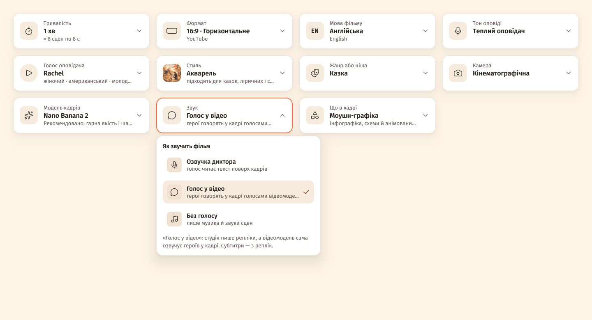
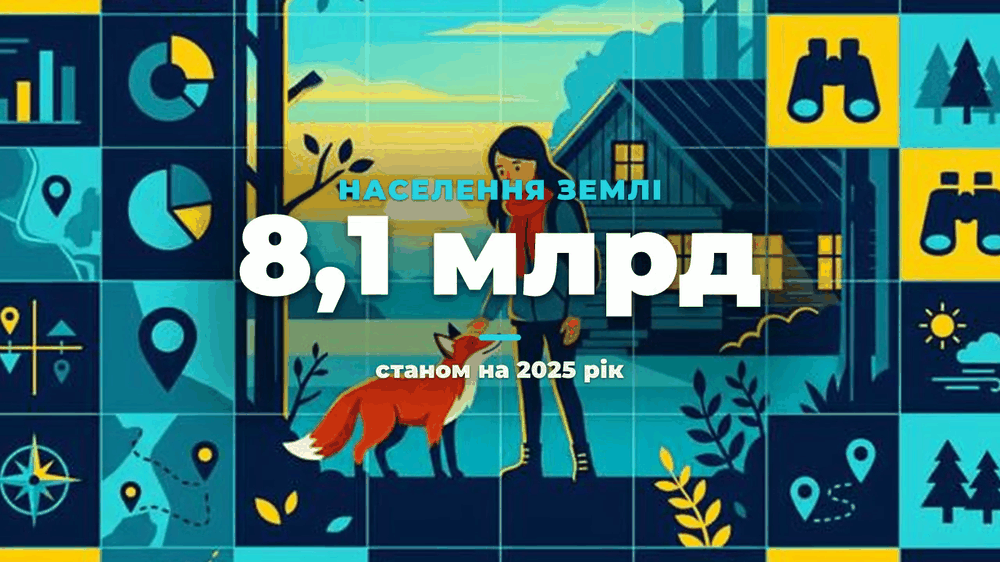
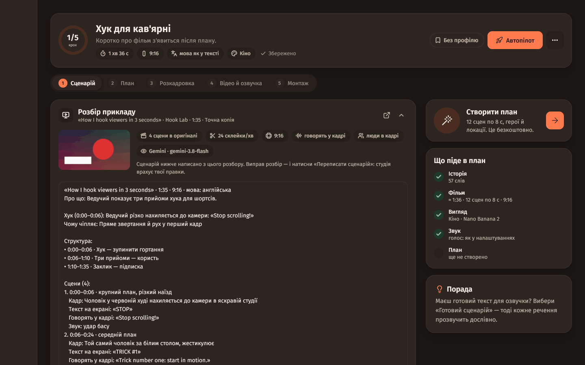
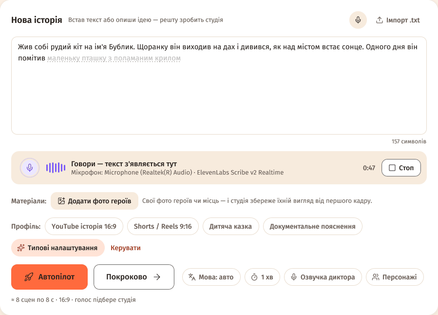
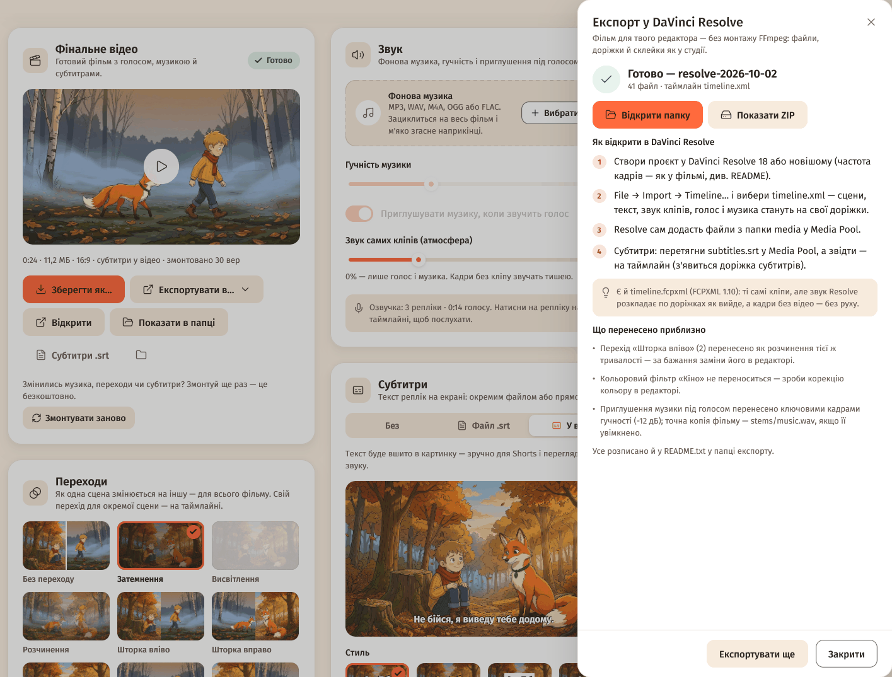
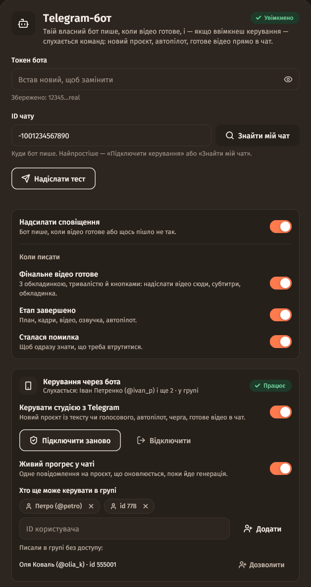
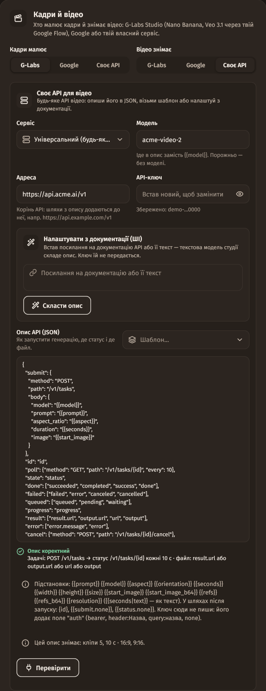
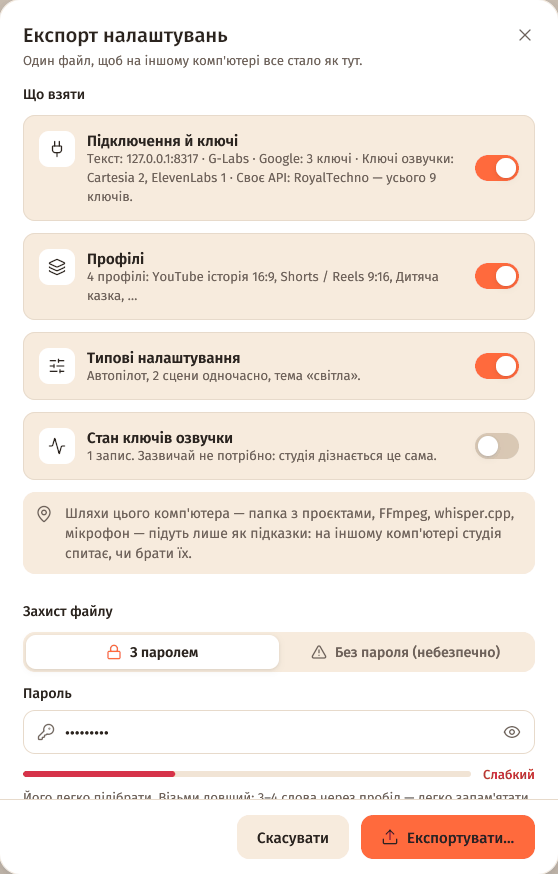

<div align="center">


# YT Cartell Studio

**AI-студія, де історія стає готовим відео.**<br>
Вставляєш текст — студія пише план, малює кадри, знімає кліпи, озвучує, монтує й віддає готовий `.mp4`.

[](../../releases)
[](../../releases/latest)
[](../../releases/latest)
<br>
[](../../releases/latest)
[](../../releases/latest)


### [⬇️ Завантажити останню версію](../../releases/latest) · [🌐 Сайт](https://gitkalenyuk.github.io/yt-cartell-studio/) · [📚 Довідник 2.0.1](https://gitkalenyuk.github.io/yt-cartell-studio/guide/) · [📣 Канал YT Cartell](https://t.me/YT_cartell)

</div>


> [!NOTE]
> Тут лежать **лише готові білди** для Windows і macOS та опис. Вихідний код закритий.
> Студія відкривається для учасників спільноти **YT Cartell** — вхід через Telegram (див. [«Доступ»](#-доступ)).

## 🆕 Що нового в 2.0.1

Велике оновлення. Уже маєш студію — натисни **«Оновлення»** в меню зліва (див. [«Оновлення»](#-оновлення)).

- 🗣 **Голос у відео** — герої говорять прямо в кадрі голосами самої відеомоделі (Veo 3.1, Omni Flash). Субтитри — з реплік. Або 🔇 **без голосу** — лише музика й звуки.
- 🎞 **Що в кадрі:** персонажі · без людей (природа, предмети, місця) · моушн-графіка (анімовані заголовки, числа, підписи) · змішано. +4 стилі (тепер 71) і +4 жанри (тепер 36).
- 🔁 **Перезняти за прикладом** — посилання на YouTube + твоє побажання: Gemini дивиться відео, розбирає його сцена за сценою, а студія робить новий фільм. Потрібен ключ Google AI Studio.
- 🎙 **Мікрофон** на Головній — говориш, і текст з'являється в «Новій історії».
- 🤖 **Telegram-бот** — новий проєкт текстом чи голосовим, проєкти, черга, прогрес наживо й готове відео прямо в чат.
- 🎬 **Експорт у редактори:** DaVinci Resolve, Premiere Pro, Final Cut Pro, CapCut, Kdenlive / Shotcut, OpenTimelineIO.
- 🔌 **Своє API для будь-якого сервісу** — шаблони, опис JSON або «Налаштувати з документації (ШІ)»; готовий пресет **RoyalTechno**.
- ☁️ **Google Gemini Omni Flash** — Veo 3.1 preview у Gemini API вимикається 22 жовтня 2026; розкадровка 3×3 і ланцюжок кадрів тепер і через Google та RoyalTechno.
- 🔑 **Озвучка:** свої ключі в кожного сервісу, ключі пачкою, голос за ID (Cartesia, ElevenLabs), AssemblyAI для розпізнавання.
- 📦 **Перенесення налаштувань** — один зашифрований файл з усіма ключами й профілями для іншого комп'ютера.
- ⚙️ **І ще:** FFmpeg одним кліком · до 20 сцен одночасно · гучність −14 LUFS · захист від двох відкритих копій.

**Як цим користуватися — у [довіднику 2.0.1](https://gitkalenyuk.github.io/yt-cartell-studio/guide/)** (див. [«Документація»](#-документація)). Повний перелік змін — у [нотатках до релізу](../../releases/tag/v2.0.1).

---

## Зміст

- [Що нового в 2.0.1](#-що-нового-в-201)
- [Як це працює](#-як-це-працює)
- [Завантажити](#-завантажити)
- [Що вміє студія](#-що-вміє-студія)
- [Скриншоти](#-скриншоти)
- [Документація](#-документація)
- [Що потрібно](#-що-потрібно)
- [G-Labs Studio](#-g-labs-studio)
- [Доступ](#-доступ)
- [Встановлення на Windows](#-встановлення-на-windows)
- [Встановлення на macOS](#-встановлення-на-macos)
  - [Через ШІ-агента](#macos-встановлення-через-ші-агента)
- [Перший запуск](#-перший-запуск)
- [Оновлення](#-оновлення)
- [Де лежать твої дані](#-де-лежать-твої-дані)
- [Варто знати](#-варто-знати)

---

## 🎬 Як це працює

Кожне відео — окремий проєкт із п'яти кроків. Можеш пройти їх разом зі студією й виправити все, що
написав ШІ, ще до того, як витрачаються кредити. А можеш просто вставити історію (або посилання на
приклад із YouTube) і натиснути **«Автопілот»** — студія сама пройде всі кроки, змонтує фільм і навіть
намалює обкладинку.

| Крок | Що відбувається |
|:---:|---|
| **1 · Сценарій** | Ідея, готовий текст, твій запис голосу або приклад із YouTube. Тривалість (15 с … 30 хв), формат 16:9 / 9:16, мова, звук (диктор, голос у відео, без голосу), що в кадрі, стиль, жанр, камера, темп. |
| **2 · План** | ШІ пише назву, опис, спільний стиль кадрів, персонажів (зовнішність і свій голос) або об'єкти, локації й сцени — з текстом озвучки чи репліками героїв. Усе редагується. |
| **3 · Розкадровка** | Спершу обличчя героїв і місця, потім перший кадр кожної сцени з ними — тож герої однакові від першого до останнього кадру. |
| **4 · Відео й озвучка** | Кожен кадр оживає в кліп, кожна репліка отримує голос — озвучкою або прямо у відео. Можна перезняти чи переозвучити будь-яку сцену. |
| **5 · Монтаж** | Таймлайн, переходи, рух камери, фільтри, субтитри, музика, анімований текст — і готовий `.mp4` з обкладинкою для YouTube. Або експорт у твій редактор. |

---

## 📥 Завантажити

Усі файли — у розділі **[Releases → остання версія](../../releases/latest)** (попередні версії — у [списку релізів](../../releases)).

| Система | Файл | Для кого |
|---|---|---|
| 🪟 **Windows 10/11** (64-біт) | `YT-Cartell-Studio-X.Y.Z-windows-x64.exe` | будь-який сучасний ПК — один файл, без встановлення |
| 🍏 **macOS 13 Ventura+ — Apple Silicon** | `YT-Cartell-Studio-X.Y.Z-macos-arm64.zip` | Mac на чипах M1, M2, M3, M4 і новіших |
| 🍏 **macOS 13 Ventura+ — Intel** | `YT-Cartell-Studio-X.Y.Z-macos-x64.zip` | Mac з процесором Intel |

`X.Y.Z` — номер версії, напр. `2.0.1`. Mac-збірки викладаються в той самий реліз, інколи трохи пізніше
за Windows: версія 2.0.1 для macOS з'явиться в релізі найближчим часом.

> [!TIP]
> Не знаєш, який у тебе Mac? Меню Apple → **Про цей Mac**: «Чип Apple M…» — бери **arm64**, «Процесор Intel» — **x64**.

---

## ✨ Що вміє студія

### Від історії до фільму
- **5 кроків** — сценарій → план → розкадровка → відео й озвучка → монтаж. Повторний запуск генерує лише те, чого ще немає, — готове не перемальовується.
- **Автопілот** — вставляєш історію, студія сама проходить усі кроки, повторює те, що не вдалося, монтує відео й малює обкладинку. Прогрес видно в «Черзі».
- **Перезняти за прикладом** 🆕 — посилання на YouTube + твоє побажання: точна копія, близько до оригіналу або лише структура й темп.
- **Профілі** — готові набори налаштувань: тривалість, формат, звук, що в кадрі, стиль, жанр, голос, мова, тон і вигляд монтажу. Чотири стартові («YouTube історія 16:9», «Shorts / Reels 9:16», «Дитяча казка», «Документальне пояснення») + свої.
- **Профіль за описом** — опиши канал звичайними словами («казки на ніч для малечі, 3 хвилини, м'яка акварель») — ШІ сам заповнить увесь профіль і пояснить, чому так.
- **93 мови** — пиши українською, а фільм отримуй англійською, іспанською чи німецькою: мова озвучки, субтитрів і назви вибирається окремо.
- **71 стиль у 6 категоріях** з живими прикладами, **36 жанрів та ніш**, 9 варіантів камери, 9 тонів оповіді.
- **Мікрофон** 🆕 — надиктуй історію: ElevenLabs, OpenAI, Deepgram, AssemblyAI, Google або whisper.cpp без інтернету.

### Кадри й відео
- **Голос у відео** 🆕 — герої говорять прямо в кадрі (Veo 3.1, Omni Flash); **без голосу** — лише музика й звуки.
- **Що в кадрі** 🆕 — персонажі, без людей, моушн-графіка або змішано, з **анімованим текстом у кадрі** (заголовки, числа з лічильником, підписи).
- **Розкадровка 3×3** і **ланцюжок кадрів** — з Omni Flash через G-Labs, Google або RoyalTechno.
- **Динамічна довжина сцен** — кліп рівно під репліку: 5,7 с мови → 6 с відео, а не 10. Перемикач **Google AI Ultra** — Veo 3.1 по 4 і 6 с у G-Labs (Omni Flash знімає 4–10 с і без нього).
- **Стартові матеріали** — додай фото своїх героїв, місць, предметів і зразок стилю: студія сама їх роздивиться, і герої в кадрах будуть саме такі.
- **Своє API** — OpenAI (GPT Image), fal.ai, Replicate, Runway, Luma, MiniMax, RoyalTechno 🆕 або **будь-який сервіс** 🆕 за описом JSON чи з документації (ШІ).
- **Google Gemini Omni Flash** 🆕 — кліпи 4–10 с, до 10 опорних кадрів.
- **До 20 сцен одночасно** 🆕 — у межах лімітів твого сервісу відео.

### Голос
- **8 сервісів озвучки** — ElevenLabs, Cartesia, OpenAI, Google Cloud (Chirp 3 HD), Azure, MiniMax, Fish Audio або свій сервер.
- **Кілька ключів з ротацією** — у кожного сервісу свої 🆕; ключі пачкою 🆕; вичерпаний місячний ліміт — ключ відпочиває до 1 числа, помилковий пропускається.
- **Голос за ID** 🆕 — будь-який голос Cartesia чи ElevenLabs за його ID.
- **Своя озвучка** — завантаж свій запис (аудіо чи відео): студія розпізнає мовлення й наріже сцени точно під нього.
- **Текст із таймкодами** — є субтитри чи розшифровка (SRT, VTT, JSON, TXT)? Додай — і розпізнавати мову не доведеться.
- **Розпізнавання мови** — ElevenLabs Scribe, Whisper, AssemblyAI 🆕 або локально через whisper.cpp — без ключа й без інтернету.

### Монтаж і обкладинка
- **Таймлайн** — перетягуй сцени, обрізай кліпи, став свій перехід між будь-якими двома сценами.
- **Доріжка голосу** — посунь репліку раніше чи пізніше, обріж з країв, виправ текст і переозвуч просто в монтажі.
- **23 переходи · 12 ефектів руху · 15 кольорових фільтрів · 8 стилів субтитрів**, фонова музика з приглушенням під голос, гучність вирівнюється до −14 LUFS 🆕. Монтаж кредитів не витрачає.
- **Експорт у редактори** 🆕 — DaVinci Resolve, Premiere Pro, Final Cut Pro, CapCut (пакет файлів), Kdenlive / Shotcut, OpenTimelineIO.
- **Студія обкладинок** — 12 шаблонів, 8 шрифтів з повною українською абеткою, виділення слова кольором, заголовок від ШІ й перегляд «як побачать на YouTube». Готовий JPEG 1280×720 (для 9:16 — 1080×1920).

### Зручності
- **Telegram-бот** 🆕 — керування студією з телефона: новий проєкт, черга, прогрес наживо, відео в чат. І сповіщення, коли відео готове.
- **Переклад проєкту** — той самий фільм іншою мовою: кадри й кліпи ті самі, заново робляться лише текст, озвучка й субтитри.
- **Перенесення налаштувань** 🆕 — зашифрований файл `.ytcs` з ключами, підключеннями й профілями.
- **FFmpeg одним кліком** 🆕 — студія сама завантажить і встановить офіційну збірку.
- **Черга** — кожна робота — картка з усіма сценами; проєкти, що чекають наступного кроку; «Нещодавно» — за тиждень.
- **Світла й темна тема** («Вечір») або «Як у системі», «Менше анімацій», тур-підказки під час першого запуску.

---

## 📸 Скриншоти

### Нове в 2.0.1

<table>
<tr>
<td width="50%"><br><sub><b>Звук і що в кадрі</b> — диктор, голос у відео або без голосу</sub></td>
<td width="50%"><br><sub><b>Анімований текст у кадрі</b> — заголовки, числа й підписи</sub></td>
</tr>
<tr>
<td><br><sub><b>Перезняти за прикладом</b> — розбір відео сцена за сценою</sub></td>
<td><br><sub><b>Мікрофон</b> — текст з'являється, поки говориш</sub></td>
</tr>
<tr>
<td><br><sub><b>Експорт у редактори</b> — DaVinci Resolve, Premiere, Final Cut, CapCut…</sub></td>
<td><br><sub><b>Telegram-бот</b> — керування студією з телефона</sub></td>
</tr>
<tr>
<td><br><sub><b>Своє API</b> — будь-який сервіс за описом JSON</sub></td>
<td><br><sub><b>Перенесення налаштувань</b> — один зашифрований файл</sub></td>
</tr>
</table>

### Основне

<table>
<tr>
<td width="50%"><br><sub><b>План</b> — персонажі, локації й сцени, усе редагується</sub></td>
<td width="50%"><br><sub><b>Розкадровка</b> — спершу герої й місця, потім кадри сцен</sub></td>
</tr>
<tr>
<td><br><sub><b>Відео й озвучка</b> — кліпи й голоси кожної сцени</sub></td>
<td><br><sub><b>Монтаж</b> — таймлайн, переходи, доріжка голосу</sub></td>
</tr>
<tr>
<td><br><sub><b>Студія обкладинок</b> — шаблони, шрифти, перегляд як на YouTube</sub></td>
<td><br><sub><b>Стилі</b> — та сама сцена в кожному стилі</sub></td>
</tr>
<tr>
<td><br><sub><b>Профіль за описом</b> — ШІ підбирає всі налаштування</sub></td>
<td><br><sub><b>Налаштування</b> — сервіси й ключі, перевірка одним кліком</sub></td>
</tr>
<tr>
<td><br><sub><b>Вхід через Telegram</b> — для учасників спільноти</sub></td>
<td><br><sub><b>Головна</b> — нова історія, профілі, автопілот</sub></td>
</tr>
</table>

---

## 📚 Документація

Покрокові інструкції до всього нового у версії 2.0.1 — на сайті:

| Розділ | Про що |
|---|---|
| [Що нового в 2.0.1](https://gitkalenyuk.github.io/yt-cartell-studio/guide/) | огляд, як оновитися, FFmpeg одним кліком, −14 LUFS, одна копія студії |
| [Голос у відео і режими](https://gitkalenyuk.github.io/yt-cartell-studio/guide/modes.html) | «Звук» і «Що в кадрі», які відеомоделі говорять, анімований текст у кадрі |
| [Перезняти за прикладом](https://gitkalenyuk.github.io/yt-cartell-studio/guide/remake.html) | ключ Google AI Studio, як працює точність, розбір прикладу, обмеження |
| [Мікрофон](https://gitkalenyuk.github.io/yt-cartell-studio/guide/mic.html) | налаштування диктування, сервіси й мови, дозвіл на мікрофон |
| [Telegram-бот](https://gitkalenyuk.github.io/yt-cartell-studio/guide/telegram.html) | @BotFather, одноразовий код, меню, відео в чат і ліміт 50 МБ, група, безпека |
| [Експорт у редактори](https://gitkalenyuk.github.io/yt-cartell-studio/guide/export.html) | що в пакеті й як відкрити в DaVinci Resolve, Premiere, Final Cut, CapCut, Kdenlive, Shotcut |
| [Своє API, RoyalTechno і Google](https://gitkalenyuk.github.io/yt-cartell-studio/guide/api.html) | шаблони, опис JSON, налаштування з документації (ШІ), Gemini Omni Flash, «Сцен одночасно» |
| [Озвучка й ключі](https://gitkalenyuk.github.io/yt-cartell-studio/guide/voice.html) | свої ключі в кожного сервісу, ключі пачкою, голос за ID, ElevenLabs, AssemblyAI |
| [Перенесення налаштувань](https://gitkalenyuk.github.io/yt-cartell-studio/guide/transfer.html) | експорт / імпорт `.ytcs`, «Замінити» чи «Об'єднати», резервна копія |

Встановлення на Mac через ШІ-агента — [INSTALL-MAC-AI.md](INSTALL-MAC-AI.md).

---

## 🧰 Що потрібно

| Що | Навіщо | Варіанти |
|---|---|---|
| **Windows 10/11 (64-біт) або macOS 13 Ventura+** | сама студія | — |
| **Telegram** | вхід і доступ | акаунт + участь у каналі й чаті YT Cartell (див. [«Доступ»](#-доступ)) |
| **Текстова модель** | план, сценарій, промти | CarteLink або будь-який OpenAI-сумісний ендпоінт (`…/v1/chat/completions`), чи Google Gemini |
| **Кадри й відео** | розкадровка й кліпи | **[G-Labs Studio](#-g-labs-studio)** з увімкненим Webhook API (Nano Banana, Veo 3.1, Omni Flash), **Google** (ключі AI Studio: Gemini Omni Flash / Veo) або своє API (RoyalTechno, fal.ai, Replicate… чи будь-яке за описом) |
| **Озвучка** | голос оповідача й героїв | ElevenLabs або інший сервіс зі списку вище (у «Голосі у відео» не потрібна) |
| **FFmpeg** (з `ffprobe`) | монтаж, мініатюри, відтворення, мікрофон, експорт | кнопка **«Встановити автоматично»** в студії; вручну — Windows: `winget install Gyan.FFmpeg`; macOS: `brew install ffmpeg` |
| **Ключ Google AI Studio** *(необов'язково)* | «Перезняти за прикладом», Google-моделі | [aistudio.google.com/apikey](https://aistudio.google.com/apikey) |
| **Telegram-бот** *(необов'язково)* | керування з телефона й сповіщення | свій бот від @BotFather |

> [!IMPORTANT]
> Усі ключі зберігаються **лише на твоєму комп'ютері**. Генерація кадрів, відео й озвучки витрачає кредити
> твоїх акаунтів у цих сервісах; сам монтаж і експорт у редактори кредитів не витрачають.

---

## 🧩 G-Labs Studio

**G-Labs Studio** — окрема програма для Windows і macOS від **duckmartians**, безкоштовна для особистого використання.
Це **не наш продукт**: YT Cartell Studio просто підключається до неї.

G-Labs Studio автоматизує Google Flow — картинки **Nano Banana** й відео **Veo** (а також Grok, Meta AI і ChatGPT GPT Image):
кілька акаунтів Google, черги й локальний **Webhook API**. YT Cartell Studio надсилає туди запити на кадри й кліпи,
тож генерація йде на кредитах **твого** акаунта Google (Free / Pro / Ultra). Кліпи Veo 3.1 по 4 і 6 с через G-Labs — лише з **Ultra**
(Omni Flash знімає 4–10 с і без неї).

**Як підключити:**

1. Встанови G-Labs Studio з [офіційного сайту](https://duckmartians.info/g-labs/en/).
2. Додай свій акаунт Google — розділ **Accounts**.
3. **Webhook API** → **Generate** (з'явиться ключ) → **Start Server**.
4. У YT Cartell Studio: **Налаштування → Підключення → Кадри й відео** — адреса `http://127.0.0.1:8765` і ключ → **«Перевірити G-Labs»**.

Посилання: [сайт](https://duckmartians.info/g-labs/en/) · [посібник](https://duckmartians.info/g-labs/guide/en/) ·
[посібник із Webhook API](https://duckmartians.info/g-labs/guide/en/webhook-api/) · [GitHub](https://github.com/duckmartians/G-Labs-Studio)

> [!TIP]
> Без G-Labs теж можна: у студії є ключі **Google AI Studio** (Gemini Omni Flash / Veo) або **своє API** — OpenAI, fal.ai, Replicate, Runway, Luma, MiniMax, RoyalTechno чи будь-яке інше за описом ([як підключити](https://gitkalenyuk.github.io/yt-cartell-studio/guide/api.html)).

---

## 🔐 Доступ

Студія — для учасників спільноти **YT Cartell**. Щоб вона відкрилась, потрібні дві речі:

1. **Канал** — [t.me/YT_cartell](https://t.me/YT_cartell). Подай заявку на вступ — адмін схвалить.
2. **Чат** — [приєднатися за посиланням](https://t.me/+Jj06Fbj8-8oyZDQ6).

Далі — у самій студії: **«Увійти через Telegram»** → підтверди вхід у браузері → **«Я підписався — перевірити»**.
Вхід запам'ятовується на цьому комп'ютері.

- Студія бачить лише твоє ім'я в Telegram і чи ти в каналі й чаті. Доступу до повідомлень немає.
- Немає інтернету — студія працює ще **24 години** після останньої успішної перевірки.
- Вийшов із каналу чи чату — студія заблокується, але генерація, що вже йде, не зупиниться, а проєкти лишаться на місці.

---

## 🪟 Встановлення на Windows

1. Завантаж `YT-Cartell-Studio-X.Y.Z-windows-x64.exe` з [останнього релізу](../../releases/latest).
2. Поклади файл у зручну папку (наприклад, `C:\YT Cartell Studio\`) і запусти. Встановлювати нічого не треба — це один файл.
3. Якщо Windows покаже **«Windows захистив ваш ПК»** — натисни **«Докладніше» → «Виконати в будь-якому разі»**
   (програма не підписана платним сертифікатом).
4. **FFmpeg:** найпростіше — **«Встановити автоматично»** на Головній або в **Налаштування → FFmpeg**: студія сама
   завантажить офіційну збірку й поставить її у свою папку без прав адміністратора. Або вручну:
   `winget install Gyan.FFmpeg` (чи `scoop install ffmpeg`), або поклади `ffmpeg.exe` і `ffprobe.exe` поруч зі студією.

## 🍏 Встановлення на macOS

Потрібна **macOS 13 Ventura або новіша**.

1. Завантаж `.zip` для свого Mac з [останнього релізу](../../releases/latest): **arm64** — Apple Silicon (M1 і новіші), **x64** — Intel.
2. Розпакуй і перетягни **YT Cartell Studio.app** у папку **Програми** (Applications).
3. Застосунок не підписаний сертифікатом Apple, тому перший запуск — так:
   - **правий клік** (або Control + клік) на застосунку → **«Відкрити»** → ще раз **«Відкрити»**;
   - якщо macOS не дає цієї кнопки — **Системні параметри → Приватність і безпека** (Privacy & Security) → унизу **«Усе одно відкрити»** (Open Anyway);
   - або одним рядком у Терміналі:
     ```sh
     xattr -dr com.apple.quarantine "/Applications/YT Cartell Studio.app"
     ```
4. **FFmpeg:** **«Встановити автоматично»** в студії (через Homebrew, якщо він є) або [Homebrew](https://brew.sh) і `brew install ffmpeg`.
5. *(необов'язково)* Локальне розпізнавання мови: `brew install whisper-cpp` — на Mac воно прискорюється відеоядром.
6. Коли вперше натиснеш мікрофон у «Новій історії», macOS спитає дозвіл на мікрофон — дозволь.

### macOS: встановлення через ШІ-агента

Не хочеш розбиратися з Терміналом? Відкрий на Mac ШІ-агента, який уміє виконувати команди (**Claude Code**,
**Codex CLI** тощо), встав інструкцію з **[INSTALL-MAC-AI.md](INSTALL-MAC-AI.md)** і запусти. Агент сам завантажить
останній реліз, звірить SHA-256, покладе програму в «Програми», зніме карантин, поставить FFmpeg через Homebrew
(і whisper-cpp, якщо скажеш) та запустить студію. Паролі вводиш тільки ти.

Коротка версія — агент сам прочитає повну інструкцію:

```text
Встанови на цей Mac YT Cartell Studio за інструкцією з
https://raw.githubusercontent.com/gitkalenyuk/yt-cartell-studio/main/INSTALL-MAC-AI.md
(виконай блок text звідти крок за кроком; паролі вводжу я сам).
```

Повна інструкція з кнопкою «Скопіювати» є й [на сайті](https://gitkalenyuk.github.io/yt-cartell-studio/#mac-ai).

---

## 🚀 Перший запуск

1. **Увійди через Telegram** (див. [«Доступ»](#-доступ)).
2. Студія покаже короткий тур: головна → історія → профілі → «Автопілот» → «Черга». Пропустити й повторити можна будь-коли.
3. **Налаштування → Підключення** — заповни сервіси й натисни **«Перевірити»** в кожній картці:
   - **Текст і сценарій** — адреса (напр. `http://127.0.0.1:8317/v1` для CarteLink), ключ, модель;
   - **Кадри** і **Відео** — G-Labs (у G-Labs Studio: *Webhook API → Generate → Start Server*, скопіюй ключ; див. [G-Labs Studio](#-g-labs-studio)), Google або «Своє API»;
   - **Озвучка** — сервіс, один чи кілька ключів, голос оповідача (кожен можна прослухати);
   - **FFmpeg** — «Перевірити» або «Встановити автоматично»;
   - за бажанням — **Google AI Studio** (для «Перезняти за прикладом»), **Диктування** (мікрофон) і **Telegram-бот** (у «Сповіщення»).
4. Уже налаштовував студію на іншому комп'ютері? **Налаштування → Дані → «Імпортувати…»** і вибери файл `.ytcs`
   ([як перенести налаштування](https://gitkalenyuk.github.io/yt-cartell-studio/guide/transfer.html)).
5. На **Головній** встав історію (або надиктуй, або «За прикладом»), вибери профіль — і тисни **«Автопілот»** або **«Покроково»**.

---

## 🔄 Оновлення

Цей репозиторій — **канал оновлень** студії. Під час запуску студія сама перевіряє [останній реліз](../../releases/latest)
і підкаже, якщо вийшла нова версія (крапка біля пункту **«Оновлення»** в меню зліва).

1. Натисни **«Оновлення»** в меню зліва.
2. **«Завантажити й встановити»** — студія завантажить нову версію й звірить контрольну суму.
3. **«Перезапустити зараз»** — якщо щось генерується, студія спершу перепитає.

Перевірити вручну можна там само («Перевірити ще раз») або в **Налаштування → Дані → «Перевірити оновлення»**.
Твої проєкти, налаштування й ключі під час оновлення не зачіпаються — вони лежать окремо від програми.

---

## 📁 Де лежать твої дані

| Що | Windows | macOS |
|---|---|---|
| Проєкти й усі згенеровані файли | `Документи\YT Cartell Studio\projects\` | `~/Documents/YT Cartell Studio/projects/` |
| Налаштування, ключі, вхід | `%AppData%\YT Cartell Studio\` | `~/Library/Application Support/YT Cartell Studio/` |
| Пакети для редакторів | `export\` у папці проєкту | `export/` у папці проєкту |
| Журнал (надішли його, якщо щось зламалось) | `%AppData%\YT Cartell Studio\studio.log` | `~/Library/Application Support/YT Cartell Studio/studio.log` |

Папку з проєктами можна змінити: **Налаштування → Дані → «Змінити…»**. Там само — «Відкрити журнал» і
«Перенести налаштування на інший комп'ютер».

---

## 💡 Варто знати

- **Потрібен інтернет хоча б раз на добу** — для перевірки доступу.
- **Закриття програми зупиняє роботу.** Готове збережеться; зупинені етапи продовжиш кнопкою «Повторити» — доробиться лише незроблене.
- **Telegram-бот працює, поки студія відкрита** на комп'ютері. Відео через бота — до 50 МБ (більше — стиснути чи частинами).
- **Одна копія студії на комп'ютері** — друга не запуститься.
- **Розкадровка 3×3 і ланцюжок кадрів — лише з Omni Flash** (G-Labs, Google або RoyalTechno). Кліпи Veo 3.1 по 4 і 6 с у G-Labs — лише з підпискою Google AI Ultra.
- **«Голос у відео»** — лише з відеомоделлю, що вміє звук (Veo 3.1, Omni Flash); студія попередить.
- **«Перезняти за прикладом»** — лише публічні відео YouTube до 90 хвилин; безкоштовний ключ Google — до 8 годин YouTube на день.
- **Veo 3.1 preview у Gemini API вимикається 22 жовтня 2026** — далі студія знімає через Gemini Omni Flash.
- **ElevenLabs** прибирає стандартні голоси 31 грудня 2026 — студія підкаже заміну.
- **До 150 сцен на фільм** — із кліпами по 8 с це близько 20 хвилин.
- **Текст на обкладинці** — латиниця й кирилиця (емодзі й інші письмена не малюються).
- Питання, ідеї, баги — у [чаті спільноти](https://t.me/+Jj06Fbj8-8oyZDQ6). Додай до повідомлення `studio.log`.

---

<div align="center">

**[⬇️ Завантажити](../../releases/latest)** · **[🌐 Сайт](https://gitkalenyuk.github.io/yt-cartell-studio/)** · **[📚 Довідник 2.0.1](https://gitkalenyuk.github.io/yt-cartell-studio/guide/)** · **[📣 Telegram](https://t.me/YT_cartell)**

<sub>Вихідний код закритий. Цей репозиторій містить лише скомпільовані білди та опис.<br>
© YT Cartell</sub>

</div>
